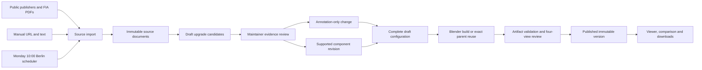
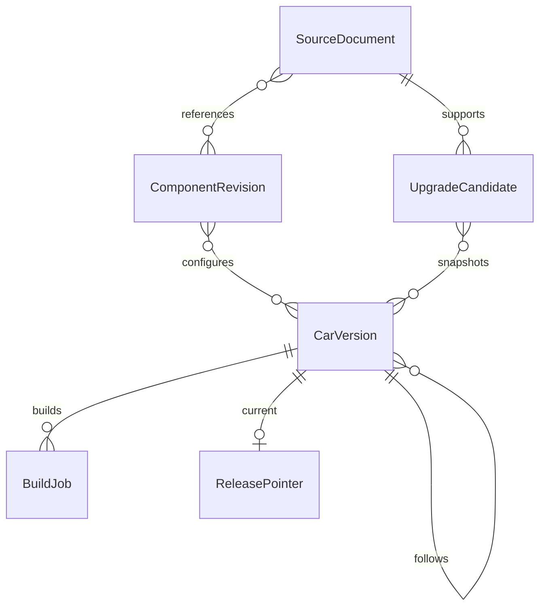

# How a car configuration becomes a release

The repository now has one runtime: Next.js and React Three Fiber in `frontend/`, FastAPI and Celery in `backend/`, and original Blender geometry in `modeling/`. Docker and the root commands target these directories. Legacy team, race, upgrade, and evidence records remain available to the maintainer; they are separate from published 2026 car configurations.

## Ownership and history

A `SourceDocument` records the original URL, canonical URL, publisher, publication date when established, retrieval time, text, and PDF page text. Reimporting unchanged content at the same canonical URL does not create duplicate claims. FIA numbered submissions are split by row; prose can produce several candidate components. Unknown assignments stay unresolved.

An `UpgradeCandidate` records the proposed team, component, observation event/date, passage/page, evidence status, and representation. Approval of a report is separate from reconstructing its shape. A reviewer can retain a confirmed report as annotation-only. Existing upgrade IDs can be linked explicitly only when their team and season match.

A `ComponentRevision` holds explicit, bounded modeling parameters, source IDs, and uncertainty. A `CarVersion` snapshots the full mapping of all eleven component revision IDs, its evidence cutoff, candidate passages, configuration event/kind, and asset manifest. Published versions and source/component records are guarded against update or deletion in PostgreSQL. Later corrections create new records.

The many-to-many mappings are frozen JSON snapshots with UUID references; they are validated in the service layer. A new published configuration updates the team's `ReleasePointer`. Rollback changes that pointer, retaining every version and its original evidence cutoff. Circuit-specific configurations and reversions are explicit version kinds.

## Builds and failure handling

PostgreSQL owns job state. Redis transports Celery tasks. The scheduler consumes a separate queue so a long render cannot prevent collection scheduling or stale-job recovery. It records one schedule key for the latest Monday due in Europe/Berlin, including daylight-saving changes, and catches up once after downtime.

A worker acquires a job attempt, renews its heartbeat, and runs native Blender as a background CPU subprocess. It freezes the builder, catalog, regulations, and component specification in an attempt directory. The scene produces the GLB and all eight studio PNGs. Unchanged configurations copy the parent's exact geometry, scene, and renders.

Before finalization, validation checks GLB structure, coordinates, wheel contact, component names, basic reviewed dimensional bounds, materials/textures, component fingerprints, file hashes, and image dimensions. The worker holds the job/version locks while atomically renaming the completed directory and marking the draft ready. A superseded attempt cannot finalize assets. Published files are never regenerated in place.

A worker interruption can recover from a finished directory or retry a stale attempt. Three automatic attempts are allowed; further attempts require the maintainer's retry control. A collection/render failure leaves the current-release pointer untouched. Publication repeats artifact validation and requires a saved four-view reference assessment.

## Browser behavior

The public archive reads published manifests only. The viewer loads the chosen version's GLB through GET; GET and HEAD both work for release assets. Its React instance is keyed by version ID. A failed load shows that same release's studio still with retry. Shared scene geometry is retained while per-view materials are cloned for selection/highlighting.

A shared camera state synchronizes comparison panels and preserves the viewing angle across release switches. Component picking resolves the GLB's `component` metadata. Differences use assembly surface fingerprints and preserve the distinction between modeled changes and reports with unavailable shape.

Maintainer authentication uses a signed, time-limited HttpOnly cookie or a server-side bearer token. Draft assets require authentication and are not cacheable. Only the web service binds a host port, on localhost; the database, Redis, and API remain on the Compose network.

See [validation results](validation.md), [modeling notes](../modeling/README.md), and [operating instructions](../README.md).
